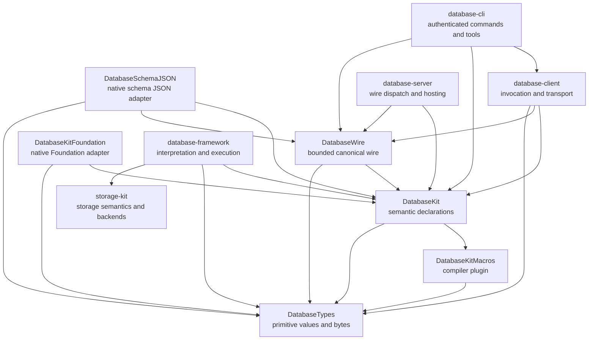
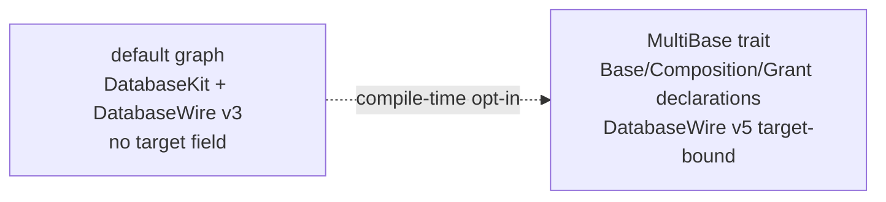
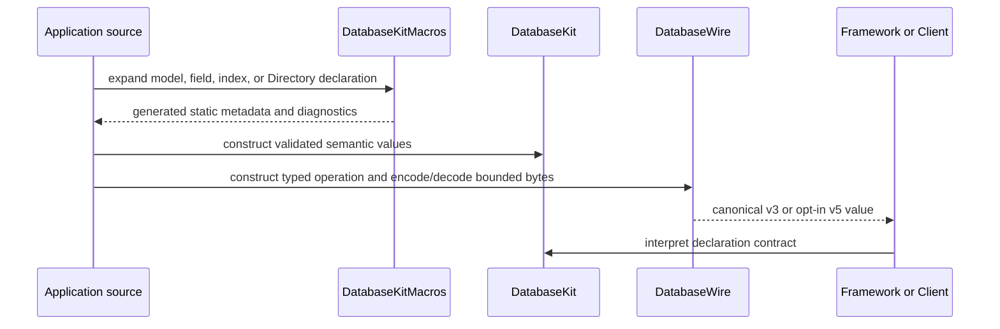

# database-kit

## Purpose and Scope

`database-kit` is the package-level authority for the Foundation-independent
database declaration interface and the canonical bounded DatabaseWire
contract. It is subordinate to the product architecture in
[`../SPEC.md`](../SPEC.md) and is indexed by the workspace design in
[`../DESIGN.md`](../DESIGN.md).

- Parent: the Database workspace system design.
- Children: [`DatabaseKit`](Sources/DatabaseKit/DESIGN.md),
  [`DatabaseKitMacros`](Sources/DatabaseKitMacros/DESIGN.md),
  [`DatabaseWire`](Sources/DatabaseWire/DESIGN.md),
  [`DatabaseKitFoundation`](Sources/DatabaseKitFoundation/DESIGN.md), and
  [`DatabaseSchemaJSON`](Sources/DatabaseSchemaJSON/DESIGN.md).
- Dependents: `database-framework` interprets declarations;
  `database-framework-cloudflare` hosts and invokes Framework execution;
  `database-client` and `database-server` consume the canonical wire contract;
  `database-cli` consumes client, schema, and wire surfaces; and
  `database-studio`, benchmarks, native applications, and tools consume the
  selected declarations or adapters.

The package is an interface layer. It declares model, schema, query, graph,
ontology, validation, mutation, identity, index, relationship, Directory, and
optional MultiBase meaning. It does not execute those declarations or provide
storage, authority, transaction, planning, execution, transport, or
application-schema services.

The default SwiftPM graph is target-free DatabaseWire version 3. The opt-in
`MultiBase` trait adds the target-bound Base, Composition, Grant, provenance,
and federated-consistency contract and selects DatabaseWire version 5. These
are compile-time graph choices, not runtime protocol negotiation.

## Responsibilities and Boundaries

| Responsibility | Owner in this package | Boundary |
|---|---|---|
| Primitive bytes and field values | `database-types` | `database-kit` consumes the value algebra and does not redeclare it. |
| Model and document metadata | `DatabaseKit` | Generated declarations adapt application models to primitives; runtime persistence is outside the package. |
| Identity, schema, relationships, indexes, graph, ontology, and SHACL declarations | `DatabaseKit` | Declarations contain logical meaning, not physical layout or execution state. |
| Storage-independent security declarations | `DatabaseKit` | Principal, policy, query, and field-rule vocabulary is declared here; authentication and policy evaluation are downstream concerns. |
| Query and mutation language models | `DatabaseKit` | Parsing, planning, authorization, and execution belong to `database-framework`. |
| Macro expansion | `DatabaseKitMacros` | The compiler plugin generates static support for the public declarations; it is not a runtime library. |
| Canonical binary operations and envelopes | `DatabaseWire` | Wire framing, codecs, bounds, and typed protocol failures are owned here; dispatch and transport are not. |
| Foundation scalar adaptation | `DatabaseKitFoundation` | Native-only adapter; it never enters the canonical or Embedded graph. |
| Strict schema JSON adaptation | `DatabaseSchemaJSON` | Native external-format adapter; it does not redefine schema or binary-wire meaning. |
| Directory and Partition mechanics | `storage-kit` | `DatabaseKit` declares `#Directory` path components and a leaf layer tag; StorageKit resolves physical Directory and Partition behavior. |
| Base placement, authority, lifecycle, and Composition execution | `database-framework` with `MultiBase` | `DatabaseKit` exposes optional declarations and wire vocabulary only. |

`DatabaseKit` is therefore not a storage abstraction and not a runtime
registry. A bridge that interprets these declarations against a
`StorageEngine` belongs to `database-framework`.

## Related Designs

| Design | Relationship | Contract used | Summary | Cautions |
|---|---|---|---|---|
| [`../SPEC.md`](../SPEC.md) | system parent | package ownership, Directory/Partition foundation, default graph, and optional MultiBase | Normative product architecture for the workspace. | A package design cannot reinterpret the system storage or authority contracts. |
| [`../DESIGN.md`](../DESIGN.md) | system index | dependency direction and package ownership | Makes this package reachable from the workspace design hierarchy. | This file is the package authority; the index contains only the relationship summary. |
| [`../database-types/AGENTS.md`](../database-types/AGENTS.md) | dependency | primitive values and immutable byte ownership | Supplies the value algebra used by every canonical module. | Semantic declarations must not migrate downward merely because they are shared. |
| [`../storage-kit/DESIGN.md`](../storage-kit/DESIGN.md) | coordinates with | None directly; downstream `database-framework` maps `DatabaseKit` declarations to StorageKit public contracts | StorageKit owns storage addresses, Directory/Partition, transaction, and backend semantics. | Keep the declaration interface independent; no storage connection or interpretation is created in this package. |
| [`../database-framework/DESIGN.md`](../database-framework/DESIGN.md) | downstream interpreter | model, schema, query, and optional MultiBase execution | Owns runtime interpretation and operation ordering. | Framework must consume the public declaration contracts without reaching into module internals. |
| [`../database-client`](https://github.com/1amageek/database-client) | downstream consumer | typed operations and canonical wire values | Adapts the package contract to client transports. | Client transport and correlation state remain outside this package. |
| [`Docs/INDEX_DECLARATION_DESIGN.md`](Docs/INDEX_DECLARATION_DESIGN.md) | supplemental design | logical index declaration | Records index-specific rationale. | Supplemental documentation is not a package or module authority. |
| [`Docs/POLYMORPHIC_DESIGN.md`](Docs/POLYMORPHIC_DESIGN.md) | supplemental design | polymorphic model membership | Records polymorphic declaration details. | Runtime member coordination remains a Framework responsibility. |
| [`Docs/ZERO_COPY_EMBEDDED_DESIGN.md`](Docs/ZERO_COPY_EMBEDDED_DESIGN.md) | supplemental design | ownership and Embedded constraints | Records performance rationale and target constraints. | The module authorities below own the current contracts. |
| [`Docs/SECURITY_GUIDE.md`](Docs/SECURITY_GUIDE.md) | supplemental design | declaration-side security vocabulary | Records security declaration guidance. | Authentication, authorization evaluation, and field enforcement remain outside the package. |

The supplemental documents above are useful context but cannot supersede this
hierarchy or the system specification.

## Architecture

The package has one semantic module, one compiler-plugin implementation, one
canonical wire module, and two explicitly native adapter modules. Arrows point
from a consumer to its dependency.

The trait boundary is separate from the dependency boundary:

## Contracts and Invariants

### Declaration ownership

- `DatabaseKit` is the user-facing declaration interface. It owns the logical
  meaning of models, identities, schemas, queries, mutations, relationships,
  indexes, graphs, ontologies, SHACL, Directory declarations, and the optional
  Base/Composition vocabulary.
- `DatabaseTypes` owns `ByteString`, `FieldValue`, and their intrinsic
  invariants. No package module creates a duplicate field-value container.
- `DatabaseKitMacros` emits static metadata and typed field identity. Runtime
  code does not depend on reflection, `Mirror`, `Any.Type`, key paths, or a
  mutable registration table.
- `DatabaseKit` declarations contain no storage connection, transaction,
  cursor, operation lease, authority, or backend handle.
- `#Directory` records declaration-side components and
  `DirectoryLayer.default` or `.partition`; StorageKit owns the node,
  Partition, Tuple, Subspace, and physical-keyspace realization.

### Trait and wire contract

| Build selection | DatabaseKit surface | DatabaseWire surface |
|---|---|---|
| Default, no `MultiBase` | One database declaration root; no Base, target, persisted Grant, provenance table, topology, or federated read-consistency payload | Version 3, target-free envelopes and operations |
| `MultiBase` trait | Base, Composition, placement/lifecycle vocabulary, Grant declarations, provenance, and federated read-consistency declarations | Version 5, explicit database/Base/Composition target on target-bound operations and the `base.execute`, `composition.execute`, and `grant.execute` families |

The standard graph never fabricates a target and never negotiates down to an
older wire version. The `MultiBase` graph is opt-in and does not change the
meaning of the default graph.

### Model, query, and schema invariants

- `Persistable` metadata is generated statically and is validated before a
  schema value is admitted to a runtime consumer.
- Field identity after macro expansion is a typed `Field<Model, Value>` or a
  canonical field reference; a `KeyPath`, `PartialKeyPath`, `AnyKeyPath`, or
  `Any.Type` is not persisted in generated runtime metadata.
- Index and relationship declarations carry logical meaning only. Physical
  indexes, planners, maintainers, query execution, and graph algorithms are
  Framework responsibilities.
- Query structure, parameters, pagination, and execution budgets are
  Foundation-independent values. `LIMIT` and `OFFSET` use bounded unsigned
  representations, and invalid structure is a typed failure.
- Directory static components use the macro's ordinary-literal contract;
  dynamic components identify existing persisted fields. Validation must not
  rewrite a source expression into a different name-resolution or byte
  representation.

### Wire and ownership invariants

- Every public wire operation descriptor is constructed by `DatabaseWire`; the
  package exposes no arbitrary raw operation or application-supplied binary
  witness.
- Encoding measures the exact frame and writes one final owned `ByteString`.
  DatabaseWire readers, result pages, and views retain that same input owner
  for their lifetime; pointer borrows used during decoding are synchronous and
  never escape their borrow scope. Bulk result pages remain lazy until a
  consumer requests materialization.
- Readers reject truncation, oversize lengths, malformed values, invalid
  nesting, non-canonical ordering, unknown values, and trailing bytes with
  typed `DatabaseWire` failures.
- A failure, cancellation, or resource-limit violation never becomes an empty
  or synthetic success value.
- Native adapters may materialize only at their explicit external-format
  boundary; their values and imports cannot leak into `DatabaseKit`,
  `DatabaseWire`, or Embedded targets.

## Runtime Flows

The package itself has no database runtime. Its observable flows end at typed
values and generated declarations:

For a Directory declaration, the generated path and leaf tag cross the package
boundary as data; Framework and StorageKit then perform interpretation,
authorization, transaction binding, and backend access.

## State, Ownership, and Lifecycle

- Macro expansion state exists only during compilation and is owned by the
  compiler plugin invocation.
- Semantic model, schema, query, and operation declarations are value-level
  contracts. The package owns no process-wide registry or mutable runtime
  catalog.
- `ByteString` owns its bytes in `DatabaseTypes`; `DatabaseWire` readers,
  pages, views, and iterators retain that same owner. Pointer borrows are
  synchronous and cannot escape their borrow scope, and no view can outlive
  its retained owner.
- Applications own declaration instances. `database-framework` owns runtime
  interpretation, storage transactions, authority, and operation lifetime;
  `database-client` owns invocation and transport lifetime; `database-server`
  owns remote dispatch and publication.
- `DatabaseKitFoundation` and `DatabaseSchemaJSON` own temporary native
  adaptation values only at their explicit API boundary and do not establish a
  second canonical representation.

## Failure, Concurrency, and Constraints

- Public semantic and wire values are `Sendable` where their contracts permit;
  no unchecked sendability or unsafe global registry is used to hide mutable
  shared state.
- The canonical graph has no Foundation, Codable-based persistence,
  URLSession, JavaScriptKit, reflection, or transport dependency. Native
  adapters are isolated in their own products.
- Every decoder applies frame, byte, collection, string, and nesting limits
  before allocating or constructing untrusted values.
- Errors distinguish malformed input, unsupported values, resource limits,
  authorization, conflicts, retryability, and server failures at the owning
  boundary. The package does not retry, authorize, or translate storage
  failures.
- Adding a semantic case requires the corresponding declaration validation,
  wire encoding/decoding, native JSON adaptation where applicable, and
  behavioral coverage in one coherent change.

## Verification and Change Impact

| Contract | Owning evidence |
|---|---|
| `DatabaseKit` model, schema, query, graph, and declaration behavior | `DatabaseKitTests` and the source-linked [`DatabaseKit` module design](Sources/DatabaseKit/DESIGN.md) |
| Macro parsing and generated declaration behavior | `DatabaseKitTests/Model` macro expansion suites and the [`DatabaseKitMacros` module design](Sources/DatabaseKitMacros/DESIGN.md) |
| Bounded v3/v5 encoding, decoding, operation catalog, lazy pages, and ownership | `DatabaseWireTests` and the [`DatabaseWire` module design](Sources/DatabaseWire/DESIGN.md) |
| Native Foundation adaptation | `DatabaseKitFoundationTests` and the [`DatabaseKitFoundation` module design](Sources/DatabaseKitFoundation/DESIGN.md) |
| Strict schema JSON adaptation | `DatabaseSchemaJSONTests` and the [`DatabaseSchemaJSON` module design](Sources/DatabaseSchemaJSON/DESIGN.md) |
| Embedded declaration graph | `DatabaseKitDeclarationContract` release compilation with the matching Embedded WASM SDK |
| Package-level trait matrix | Native standard run (641 tests) and isolated `MultiBase` run (656 tests), plus the standard/Embedded release builds documented in `README.md` |

The package-level authority changes when package ownership, trait selection,
wire version, public declarations, ownership, failure behavior, or target
support changes. Such a change must update the affected module authority and
re-check the direct and transitive designs from the workspace root. A runtime
execution change belongs to its owning downstream package and does not modify
this package's declaration contract unless its public assumptions change.
