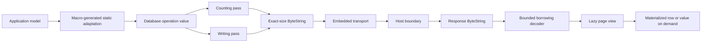

# Zero-Copy and Embedded Architecture

## Status

This document defines the target architecture for the performance-sensitive
path shared by `database-types`, `database-kit`, `DatabaseWire`, and the
Embedded core of `database-client`.

It is normative for changes to model adaptation, byte ownership, Wire
encoding, Wire decoding, result paging, and Embedded transport boundaries.
The version 1 implementation must be designed from these constraints; existing
APIs are not compatibility requirements.

## Architectural priorities

Correct database meaning and explicit ownership are prerequisites. Within that
correctness boundary, zero-copy data flow and Embedded suitability are primary
architecture inputs rather than later optimizations.

| Priority | Requirement | Consequence |
|---:|---|---|
| 1 | Correct semantics and explicit ownership | No hidden coercion, lifetime, fallback, or partial success |
| 2 | Zero-copy on performance-sensitive paths | One final owner, bounded views, and no intermediate byte materialization |
| 3 | Small Embedded runtime | No Foundation, reflection, semantic type-erasure registry, or runtime handler registration in the Embedded graph |
| 4 | Convenience | Added only when it preserves the first three requirements |

Zero-copy does not mean zero allocation and does not claim that a network or
JavaScript heap can share Swift ownership. It means that payload bytes are not
copied between internal processing stages. A copy at an ownership boundary is
permitted only when the two runtimes cannot share an owner.

## End-to-end data path



The owned frame is the lifetime root. Envelope payloads, byte fields,
continuation tokens, versions, job chunks, and lazy pages retain bounded ranges
of that owner.

## Copy budget

Every implementation must be reviewable against this budget.

| Transition | Payload copies | Required behavior |
|---|---:|---|
| Semantic request to encoded Swift frame | 0 intermediate, 1 final allocation | Measure, allocate exactly, write final storage |
| Envelope decode to payload view | 0 | Retain the frame and advance bounded ranges |
| Byte-valued field decode | 0 | Return a `ByteString` slice retaining the frame |
| String decode | 1 semantic materialization when requested | Validate UTF-8 first; do not create an intermediate byte array |
| Query or graph page acceptance | 0 payload copies | Validate structure and retain a page range |
| One requested row | 0 byte copies | Materialize only row metadata and semantic values needed by the caller |
| Swift WASM request to asynchronous JavaScript/Worker ownership | At most 1 | Host consumes or copies during the synchronous borrow |
| JavaScript/Worker response to Swift owner | Exactly 1 when heaps cannot be shared | Copy directly into the final exact-size Swift allocation |
| Native `Data` boundary | 0 when stable ownership can be retained safely; otherwise 1 | Never weaken the Embedded core representation to avoid this boundary copy |

Small metadata arrays, validated semantic objects, and execution structures may
allocate when their semantics require ownership or random access. They must not
cause the large byte payload to be copied.

## `database-types` byte prerequisite

`ByteString` is the only canonical owned byte value. `DatabaseBytes` and other
module-specific byte aliases do not exist.

`ByteString` may retain `any ByteStringOwner` on every Swift 6.4 target,
including Embedded. This protocol is the externally selected ownership
contract for stable, immutable, contiguous bytes. It is not semantic model,
operation, or codec type erasure. Retaining the owner is what permits a buffer
produced by another package to cross the package boundary without copying.

Every owner exposes one stable count and must invoke each synchronous borrow
exactly once with the same bytes. The pointer cannot escape the borrow.
Overlapping and nested borrows are supported. Foundation `Data`, an escaping
borrow closure, an untyped deallocator, or mutable external storage is not part
of the canonical backing.

An adapter performs one documented conversion-boundary copy only when its
source cannot satisfy that immutable owner contract. Dynamic dispatch for the
owner borrow is an accepted constant ownership cost; copying the complete
payload to avoid it is not.

`ByteString` provides:

- immutable value semantics;
- constant-time bounded slicing;
- synchronous scoped byte borrowing;
- exact-size final allocation;
- explicit detachment when a small result must stop retaining a large owner.

It does not provide an asynchronous pointer borrow. A pointer never survives
the borrowing closure.

## Static model adaptation

`@Persistable` generates the complete model adaptation path. The production
path does not use:

- `Mirror`;
- `any Persistable`;
- `[any Descriptor]`;
- `[any Persistable.Type]`;
- dynamic casts to discover supported property types;
- `Codable` or JSON;
- string-based type recovery;
- mutable global registration.

The generated shape is generic over a concrete field output or input. Each
boundary preserves its own typed failure:

```swift
public protocol PersistedFieldOutput {
    associatedtype Failure: Error & Sendable

    mutating func write<Value: FieldValueEncodable>(
        _ identity: FieldIdentity,
        value: borrowing Value,
        entity: String
    ) throws(PersistableEncodingFailure<Failure>)
}

public protocol PersistedFieldInput {
    associatedtype Failure: Error & Sendable
}

public enum PersistableEncodingFailure<
    OutputFailure: Error & Sendable
>: Error, Sendable {
    case adaptation(PersistableEncodingError)
    case output(OutputFailure)
}

public enum PersistableDecodingFailure<
    InputFailure: Error & Sendable
>: Error, Sendable {
    case input(InputFailure)
    case adaptation(PersistableDecodingError)
}

public protocol Persistable: Sendable {
    associatedtype ID: PersistableIdentifier

    var id: ID { get }

    func encodePersistedFields<Output: PersistedFieldOutput>(
        to output: inout Output
    ) throws(PersistableEncodingFailure<Output.Failure>)

    func persistedFieldValue(
        for field: FieldIdentity
    ) throws(PersistableEncodingError) -> FieldValue?

    static func decodePersistedFields<Input: PersistedFieldInput>(
        from input: inout Input
    ) throws(PersistableDecodingFailure<Input.Failure>) -> Self
}
```

`PersistedFieldOutput` and `PersistedFieldInput` are semantic database
boundaries. They are not Wire or storage protocols. DatabaseWire,
database-framework, and explicit owned materializers provide concrete generic
implementations.

Generated code maps field conversion and model validation failures to
`adaptation`. It maps a concrete output or input failure without changing its
type to `output` or `input`. A non-failing materializer uses `Never` as its
boundary failure. DatabaseWire limits therefore remain `DatabaseWireError`;
storage failures remain owned by their storage boundary.

Generated field traversal is ordered by stable field number. It passes field
identity and typed values directly to the concrete output. The Wire and storage
paths therefore do not first construct `[PersistableField]` or a dictionary.
An explicitly requested owned representation may materialize
`[PersistableField]` or `FieldObject`.

Primitive application conversion uses directional Swift contracts:

```swift
public protocol FieldValueEncodable: Sendable {
    func encodeFieldValue() throws(PersistableEncodingError) -> FieldValue
}

public protocol FieldValueRepresentable: FieldValueEncodable {
    func encodeFieldValue() -> FieldValue
}

public protocol FieldValueDecodable: Sendable {
    static func decodeFieldValue(
        _ value: FieldValue,
        field: String
    ) throws(PersistableDecodingError) -> Self
}
```

`FieldValueRepresentable` is a total representation contract, not a
bidirectional convenience alias. Query construction uses it when a valid
`FieldValue` must exist at initialization time. A public catch-all `Codec` is
not introduced.
Foundation scalar conformances are supplied only by
`DatabaseKitFoundation`, which uses the canonical conversion rules from
`DatabaseTypesFoundation`.

Nested models are traversed recursively through concrete generic types. A
`FieldObject` is materialized only when an owned object value is the requested
semantic result.

### Compile-time field selection

Swift 6.4 KeyPath syntax is the developer-facing field-selection language.
A macro validates the selected stored property and consumes the KeyPath syntax
during expansion. The generated runtime declaration contains no `KeyPath`,
`PartialKeyPath`, or `AnyKeyPath` value.

```text
\Event.title
      │ Swift 6.4 macro validation and expansion
      ▼
Event.fields.title: Field<Event, String>
      │
      ▼
field number + field name + FieldSchemaType
```

`@Persistable` generates a typed field namespace:

```swift
Event.fields.title
```

`#field(\Event.title)` is compile-time syntax for the same generated
`Field<Event, String>` value. Query and manual declaration APIs consume
generated `Field<Model, Value>` values. Schema macros may accept KeyPath syntax
directly because the macro removes it before runtime code is emitted.

Generated fields contain stable field identity and schema type, not a retained
KeyPath. Application source therefore keeps compiler-checked property
selection while the Embedded binary does not depend on the runtime KeyPath
representation.

Index validation consumes `FieldSchemaType` values. It does not inspect
`Any.Type`, recover a field name from KeyPath description, or use runtime type
casts.

A Swift 6.4 Embedded build test compiles representative `#field`, index, query,
and relationship declarations. It also examines macro-expanded client code and
rejects runtime KeyPath references. Support is established by this executable
gate, not inferred from successful native macro expansion.

The compiler-ordering feasibility gate passed on 2026-07-25 with the Swift 6.4
development snapshot dated 2026-07-17 and its exactly matching Embedded WASM
SDK. A freestanding expression macro declared with a
`KeyPath<Root, Value>` parameter accepted `#field(\Event.title)`, expanded the
complete expression to a non-KeyPath value, and linked the Embedded WASM
product. This proves the source-language boundary is viable; production
acceptance still requires the real generated `Field<Event, String>` expansion
and the complete tests listed above.

## Schema and descriptor representation

`Schema.Entity` is a pure validated semantic value. It does not retain a Swift
metatype, model instance, closure, runtime handler, or backend state.

Heterogeneous schema declarations use validated concrete representations.
Built-in and custom index declarations canonicalize to `IndexDescriptor`;
relationship, ontology, SHACL, and security declarations canonicalize to their
own concrete semantic descriptors. If one heterogeneous collection is required,
it uses a closed `SchemaDescriptor` value with explicit cases.

Runtime behavior is registered separately in `database-framework` through
generic composition. A schema does not become a runtime registry.

Polymorphic model groups do not store or return existential model instances.
A finite application schema generates a discriminator switch or a closed
application-owned sum type. Dynamic runtime data remains a `FieldObject` until
the caller selects a concrete model type.

## DatabaseWire encoding

The public directions are `DatabaseWireEncoder` and
`DatabaseWireDecoder`. There is no public umbrella `Codec`.

DatabaseWire publishes a closed generic operation descriptor:

```swift
public struct DatabaseOperation<
    Request: Sendable,
    Response: Sendable
>: Sendable {
    public let identifier: DatabaseOperationIdentifier
}

public enum DatabaseOperations {
    public static let queryExecute: DatabaseOperation<
        QueryExecuteOperation.Request,
        QueryExecuteOperation.Response
    >
}
```

The descriptor initializer and its encoding witnesses are not public.
DatabaseWire constructs every descriptor and exposes the fixed version 1
operation catalog. `DatabaseClient` accepts a descriptor value, encodes its
statically bound `Request`, and decodes only its bound `Response`.

Low-level `DatabaseWireEncodable`, `DatabaseWireDecodable`, and untyped Wire
value protocols are implementation contracts, not public application
conformance points. Applications extend `command.execute` through semantic
command declarations whose input and output adapt through generated persisted
field traversal. They cannot replace the command envelope, operation
identifier encoding, limits, or canonical binary representation.

Encoding uses two deterministic traversals over an immutable operation value:

1. a counting output validates limits and computes the exact frame size;
2. one `ByteString` allocation is created;
3. a writing output fills that final allocation directly;
4. the final byte count must equal the measured count.

The low-level output is generic or uses concrete internal destinations. It does
not store a protocol existential. A public arbitrary encoding closure is not
the canonical API because a captured mutation could produce different counting
and writing passes.

Both passes must be pure with respect to the encoded value. Encoders do not
read clocks, randomness, global state, or mutable registries.

Strings write their UTF-8 storage directly when contiguous and otherwise emit
scalars without building an intermediate `[UInt8]`. `ByteString` values are
borrowed synchronously and copied only into their final position in the encoded
frame.

## DatabaseWire decoding

`DatabaseWireDecoder` owns or retains one input `ByteString` and advances an
integer cursor. Child frames and length-prefixed payloads are bounded ranges of
the same owner.

Before allocation or semantic construction, decoding enforces:

- maximum frame bytes;
- maximum string and byte-string bytes;
- maximum collection elements;
- maximum decoded objects;
- maximum nesting depth;
- integer-overflow checks;
- canonical ordering;
- exact tag and protocol-version validity;
- complete consumption with no trailing bytes.

Recursive formats use an explicit bounded stack when input depth can approach
the configured limit. Hostile input cannot consume the native or WASM call
stack without a corresponding resource bound.

Malformed input returns `DatabaseWireError`. It does not trap, substitute an
empty value, or defer structural failure until database execution.

## Large result views

Control responses and small mutation results are materialized normally. Bulk
results are owner-retaining views:

- query row pages;
- RDF graph pages;
- graph algorithm pages;
- job result pages;
- maintenance output containing bulk data.

A page decoder first performs bounded structural validation without copying
the payload. The resulting page stores the frame owner and validated ranges.
Its iterator materializes one row, quad, or item at a time.

```swift
public struct QueryRowPage: Sendable {
    public func makeRowIterator() -> QueryRowIterator
}

public struct QueryRowIterator {
    public mutating func next()
        throws(DatabaseWireError) -> QueryRow?
}
```

`QueryRow` may own its small `[FieldValue]` collection. Any byte-valued
`FieldValue` in that row still borrows the page frame. Strings are materialized
only for the row the caller requests.

An API that materializes the entire page is explicit, applies a separate
materialization limit, and is never called by the default client path.

Job result transfer declares the total result byte count before chunk
assembly. The client allocates the final result once and writes each validated
chunk into its final range while updating the digest. It does not append to a
growing `[UInt8]`.

## Embedded database client

The core client remains generic and Foundation-independent:

```swift
public protocol DatabaseTransport: Sendable {
    func send(
        _ request: consuming ByteString
    ) async throws(DatabaseTransportError) -> ByteString
}

public struct DatabaseClient<
    Transport: DatabaseTransport,
    RequestIDs: DatabaseRequestIDSource
>: Sendable {
    // Concrete generic dependencies only.
}
```

The client does not store `any DatabaseTransport`. Request identifiers come
from an injected concrete source:

```swift
public protocol DatabaseRequestIDSource: Sendable {
    func reserveRequestID()
        throws(DatabaseRequestIDReservationError) -> UInt64
}
```

The default `MonotonicRequestIDSource` owns `Atomic<UInt64>`. Reservation uses
a compare-exchange loop with relaxed ordering because the atomic value
establishes identifier uniqueness, not publication of other memory. It never
performs I/O or suspension.

The sequence starts at one. Reaching `UInt64.max` returns
`DatabaseRequestIDReservationError.exhausted`; it never wraps and therefore
never reuses an identifier that might still be in flight. An injected source
must preserve the same nonzero, unique, non-reusing contract.

The core client:

- encodes directly to one owned request frame;
- transfers ownership of that frame to the transport;
- retains the response frame while decoding and while any page view exists;
- maps transport, Wire, correlation, and remote failures without erasing their
  categories;
- does not contain URLSession, JavaScriptKit, Foundation, WebSocket, or Worker
  routing behavior.

## WASM host transport

The Embedded Worker path uses a small explicit host ABI, not JavaScriptKit.
JavaScript owns Promise integration and Durable Object RPC but receives no
query, schema, index, or transaction semantics.

The ABI separates synchronous byte borrowing from asynchronous completion:

```text
Swift request ByteString
  │ synchronous borrowed pointer
  ▼
host starts request and copies only if asynchronous ownership requires it
  │
  ▼
host signals response-ready(call ID, status, exact byte count)
  │
  ▼
Swift allocates final ByteString once
  │ synchronous host copy directly into final destination
  ▼
completed Swift response owner
```

The request pointer is valid only during the start import. The host must not
retain it. When a response is ready, Swift allocates its final exact-size
storage and asks the host to fill that destination synchronously. No temporary
Swift `[UInt8]` or second `ByteString` is created.

The externally fixed ABI symbol is kept in an import or export descriptor.
Swift functions are named for `startDatabaseRequest`,
`completeDatabaseRequest`, `copyDatabaseResponse`, and
`cancelDatabaseRequest`, not for calling conventions or implementation
languages.

The host-boundary pending-call table contains one concrete continuation type
and is isolated to the transport lifecycle. It is not a database semantic
registry.

## Native transports

HTTP and WebSocket products are adapters outside the Embedded dependency graph.
They accept and return `ByteString`.

When URLSession requires `Data` ownership, the request adapter performs one
documented boundary copy unless it can transfer an independently owned buffer
safely. A response may retain native data without copying when it provides an
immutable `ByteStringOwner` that satisfies the same Native and Embedded
ownership contract. Otherwise it performs one exact-size boundary copy.

Fragmented responses accumulate segments without repeatedly copying existing
payload. Once the final byte count is known, the adapter creates one final
contiguous frame. Repeated `Data.append`, growing `[UInt8]`, and
fragment-by-fragment frame reconstruction are not accepted.

## Error and lifetime contract

All public database-semantic and Wire failures in the Embedded graph use typed
throws. Generic synchronous byte borrows preserve the caller-provided failure
type and do not create or erase a database failure.

Every borrowed pointer:

- is created and consumed synchronously;
- cannot escape its closure;
- cannot cross `await`;
- retains its owner for the complete borrow;
- is never used after a possible WASM memory growth.

Every async boundary transfers an owned `ByteString` or an opaque call
identifier, never a borrowed pointer.

Cancellation completes the pending call exactly once, releases the request and
response owners, and tells the host to cancel when supported. Timeout and host
failure are explicit transport failures rather than empty responses.

## Lightweight code-size contract

The Embedded product graph contains only:

```text
DatabaseTypes
    ▲
DatabaseKit
    ▲
DatabaseWire
    ▲
DatabaseClient
    ▲
WASM host transport
```

Feature declarations remain in responsibility-based modules. Static generic
operation binding allows dead stripping of unused operation implementations.
No operation registry eagerly retains every handler or codec.

Compiler-plugin and SwiftSyntax dependencies are build-time only. Foundation,
FoundationEssentials, JavaScriptKit, URLSession, WebSocket implementations,
database-framework, storage backends, and Cloudflare runtime code are absent
from the Embedded artifact.

## Verification gates

Structure and type checks are insufficient. Acceptance requires observed
behavior on the production path.

| Gate | Required evidence |
|---|---|
| Embedded compilation | Release build with a Swift 6.4-or-newer compiler and exactly matching Embedded WASM SDK |
| KeyPath macro boundary | Swift 6.4 Embedded compiles source KeyPath declarations and expanded runtime code retains no KeyPath value |
| Dependency closure | Build graph contains only the products listed above |
| Operation closure | Only DatabaseWire-provided descriptors can select an operation identifier or binary representation |
| Request identifiers | Concurrent reservation is unique, starts at one, never wraps, and reports exhaustion |
| Request encoding | One final frame allocation; no intermediate payload copy |
| Envelope and byte decode | Frame and byte fields share the same backing owner |
| Bulk page decode | Initial page acceptance does not allocate one object per row |
| Row iteration | Only requested rows are materialized |
| Host request boundary | Zero internal Swift copies and at most one host-ownership copy |
| Host response boundary | One copy directly into the final Swift allocation |
| Job assembly | One final result allocation, bounded chunk writes, incremental digest |
| Decoder safety | Truncation, limits, invalid tags, invalid UTF-8, overflow, and trailing bytes fail deterministically |
| Code size | Release artifact size recorded and compared on every architecture-changing change |
| Peak memory | Cold request, maximum page, and maximum job chunk peak memory recorded |

Copy-count tests use backing-owner identity or instrumented allocation hooks.
Benchmarks report frame size, operations per second, allocated bytes, allocation
count, and peak resident or linear memory. A zero-copy claim without one of
these observations is not accepted.

## Implementation status

The model and schema boundaries now implement the static contract described
above:

| Area | Implemented contract |
|---|---|
| Model adaptation | Macro-generated generic field output; no `Mirror`, `Any`, dynamic-member, or existential model path |
| Selected field access | `FieldIdentity` selection through the same generated traversal; only the selected `FieldValue` is materialized |
| Schema | Pure validated entity values; no retained model metatypes, runtime KeyPaths, or descriptor existential arrays |

The database-kit-owned production paths implement the completed contract:

| Area | Implemented contract |
|---|---|
| Bytes | Canonical `ByteString` with immutable owner retention and constant-time slices |
| Wire API | Closed DatabaseWire-provided operation descriptors and internal directional encoding |
| Query and RDF results | Validated owner-retaining pages with on-demand element materialization |
| Algorithm, ontology, SHACL, and maintenance results | The same owner-retaining page contract for every bulk result family |
| Job results | Exact-size result pages, bounded chunk writes, and incremental digest |
| Failures | Typed semantic and Wire failures; caller-supplied borrow failures preserve their generic failure type |

`database-client`, the WASM host transport, and database-framework are
downstream consumers of these contracts. Their transport and execution work is
not an implementation path inside database-kit and is not a database-kit
completion gate. Ecosystem integration still requires those packages to
consume the same `ByteString`, operation descriptors, and owner-retaining
results without compatibility aliases, duplicate DTOs, fallback reflection,
or JSON protocol routes.
