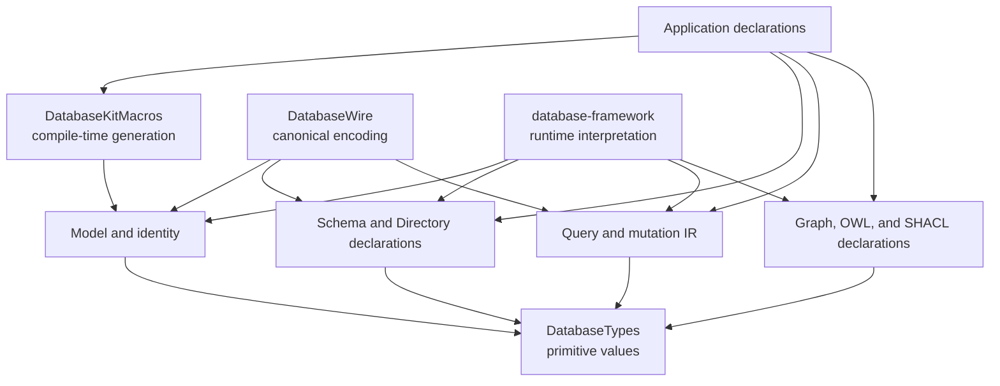
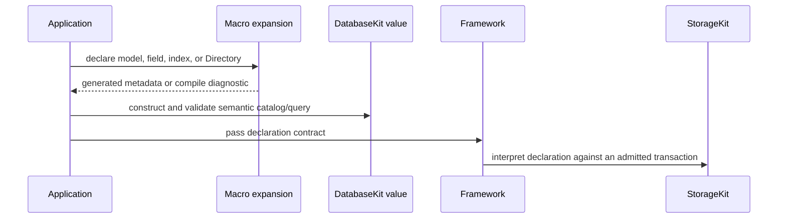

# DatabaseKit

## Purpose and Scope

`DatabaseKit` is the Foundation-independent semantic declaration module of
[`database-kit`](../../DESIGN.md). It provides the public model, identity,
schema, query, mutation, relationship, index, graph, ontology, SHACL,
Directory, and optional MultiBase declaration contracts.

- Parent: [`database-kit` package design](../../DESIGN.md).
- Children: none; `Base`, `Query`, `Graph`, `Identity`, `Index`, `Model`,
  `Mutation`, `Relationship`, `Schema`, and `Security` are source
  classifications inside this module, not separate design authorities.
- Dependencies: `DatabaseTypes` and the `DatabaseKitMacros` compiler plugin.
- Dependents: `DatabaseWire`, `DatabaseKitFoundation`,
  `DatabaseSchemaJSON`, `database-framework`, `database-client`, and native
  applications.

The module is an interface, not an execution layer. It owns pure semantic
validation and canonical transformation of declaration values; downstream
runtime owners interpret that intent.

## Responsibilities and Boundaries

`DatabaseKit` owns:

- `Persistable` model/document metadata and generated field identity;
- canonical logical identity and references;
- schema entities, versions, fingerprints, directory declarations, and
  polymorphic membership;
- storage-independent security declaration values and field access rules;
- logical relationship and index declarations;
- SQL, SQL/PGQ, and SPARQL query/mutation models and structural validation;
- RDF, OWL, ontology, and SHACL declaration and validation values;
- the compile-time public macro declarations whose implementations live in
  `DatabaseKitMacros`;
- `Base`, `Composition`, Grant vocabulary, placement, provenance, and read
  consistency declarations only when the `MultiBase` trait is selected.

It does not own primitive field values, binary framing, Foundation adaptation,
storage addresses, physical Directory/Partition state, authorization
evaluation, transaction or cursor lifetime, query planning, index maintenance,
graph execution, transport, or application schemas.

## Related Designs

| Design | Relationship | Contract used | Summary | Cautions |
|---|---|---|---|---|
| [`../../DESIGN.md`](../../DESIGN.md) | package parent | module boundary and trait matrix | Package design composes this module with the macro, wire, and native adapters. | Package-level v3/v5 selection is authoritative. |
| [`../../../SPEC.md`](../../../SPEC.md) | system authority | DatabaseKit declaration ownership and Directory layer tag | Fixes the separation between declaration and StorageKit execution. | A `DirectoryLayer` declaration is not the FoundationDB bindings type. |
| [`../DatabaseKitMacros/DESIGN.md`](../DatabaseKitMacros/DESIGN.md) | implementation dependency | static expansion and diagnostics | Implements the macros declared by this module. | Macro code must not add runtime semantics. |
| [`../DatabaseWire/DESIGN.md`](../DatabaseWire/DESIGN.md) | downstream module | semantic values consumed by codecs | Encodes selected declarations as canonical v3 or v5 wire values. | Wire framing and protocol errors remain in `DatabaseWire`. |
| [`../../../database-framework/DESIGN.md`](../../../database-framework/DESIGN.md) | downstream interpreter | validated declarations and execution budgets | Interprets schemas, queries, and optional MultiBase values. | It owns execution, not this module. |

## Architecture

## Contracts and Invariants

- `DatabaseTypes` is the only owner of `FieldValue`, `ByteString`, and
  primitive alternatives. This module consumes those values without aliases,
  wrappers, or a second algebra.
- Macro-generated metadata stores typed field identity and validated catalog
  values. Runtime declarations never retain key paths, `AnyKeyPath`, or
  `Any.Type` as semantic identity.
- `Persistable.schemaEntity` and manual schema construction pass through the
  same intrinsic validation boundary. Duplicate fields, invalid identifiers,
  incompatible indexes, invalid relationships, and malformed directory
  declarations remain typed failures.
- A `#Directory` declaration emits ordered static or dynamic components and a
  leaf `DirectoryLayer` value. Dynamic components refer to persisted scalar
  fields; `.partition` requires a dynamic component. The module does not
  resolve or allocate the physical node.
- Polymorphic directory declarations preserve their layer and shared path
  contract; concrete member agreement is a schema invariant. Runtime member
  transactions and placement are Framework/StorageKit behavior.
- `ExecutionBudget`, query structure, expressions, graph patterns, and
  mutation values are portable semantic contracts. They do not contain
  backend cursors, transactions, transport state, or planner choices.
- The default build excludes all Base, target, Grant, provenance, and
  federated-read fields. The `MultiBase` trait adds those declarations as a
  separate compile-time surface and does not alter the default surface.
- All failures preserve their typed error category. This module never turns a
  malformed declaration or query into a default or empty successful value.

## Runtime Flows

The last two interactions are owned by downstream packages. `DatabaseKit`
only produces the validated values consumed at that boundary.

## State, Ownership, and Lifecycle

- Semantic values are application-owned value instances. The module has no
  global catalog, connection, transaction, lease, or mutable registration.
- The macro plugin owns compile-time expansion state only for the duration of
  the compiler invocation.
- A schema value owns its validated declaration collections. It does not own a
  runtime model registry or the storage data described by those declarations.
- Primitive byte storage and scoped byte borrowing follow the `DatabaseTypes`
  ownership contract.

## Failure, Concurrency, and Constraints

- Public values use `Sendable` and value semantics where their contracts
  permit; no unchecked concurrency escape is introduced by this module.
- The module is available to standard and Embedded graphs without Foundation,
  Codable persistence, reflection, JavaScriptKit, or transport dependencies.
- Query and schema validation applies structural and intrinsic limits before a
  downstream runtime can interpret a value.
- Backend capability failures, transaction conflicts, authorization, and
  runtime resource exhaustion are reported by the owning downstream package;
  this module does not catch or rewrite them.

## Verification and Change Impact

| Contract | Evidence owner |
|---|---|
| Model, identity, schema, query, graph, and declaration behavior | `Tests/DatabaseKitTests` |
| Macro expansion and Directory declaration validation | `Tests/DatabaseKitTests/Model` and `DatabaseKitDeclarationContract` |
| Standard semantic graph | Standard `DatabaseKitTests` execution in the package harness |
| Optional MultiBase declarations | Isolated `MultiBase` `DatabaseKitTests` execution |

Changes to public semantic declarations, macro-generated metadata, Directory
meaning, or the MultiBase compile-time surface require this module design and
the package design to be reviewed together. Physical placement, transaction,
authority, and runtime changes are reviewed in StorageKit or Framework instead.
