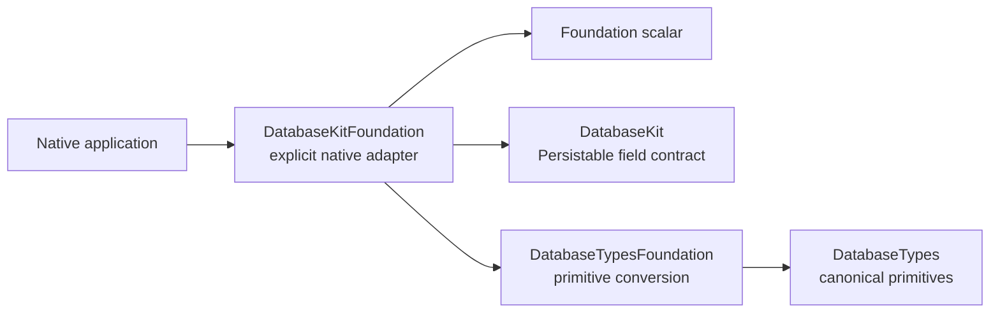
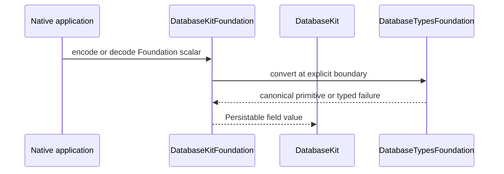

# DatabaseKitFoundation

## Purpose and Scope

`DatabaseKitFoundation` is the optional native adapter that lets Foundation
scalar values participate in the `DatabaseKit` `Persistable` field adaptation
contract. It is not part of the canonical semantic or wire graph.

- Parent: [`database-kit` package design](../../DESIGN.md).
- Children: none; the scalar extensions are implementation units of this
  native adapter module.
- Dependencies: `DatabaseKit`, `DatabaseTypes`, `DatabaseTypesFoundation`, and
  Foundation.
- Dependents: native applications and native test targets that explicitly
  choose this product.

The adapter is excluded from `DatabaseKit`, `DatabaseWire`, and Embedded
targets. Foundation values are converted at this explicit boundary rather than
becoming canonical primitive or wire types.

## Responsibilities and Boundaries

This module owns:

- Foundation `Data`, `Date`, `DateComponents`, `Decimal`, and `UUID`
  participation in `Persistable` field encoding/decoding;
- typed translation between those Foundation values and the canonical
  `DatabaseTypes`/`DatabaseKit` values.

`Data` decoding is the explicit native ownership boundary: because Foundation
`Data` cannot retain an arbitrary `ByteString` owner through its public value
API, the decoder makes one documented copy. Other scalar conversions remain
typed value conversions without changing the canonical byte owner contract.

It does not own primitive value definitions, semantic schema/query meaning,
binary framing, JSON schema meaning, storage, transactions, transport,
runtime registration, or application model definitions.

## Related Designs

| Design | Relationship | Contract used | Summary | Cautions |
|---|---|---|---|---|
| [`../../DESIGN.md`](../../DESIGN.md) | package parent | native adapter boundary | Keeps Foundation out of the canonical and Embedded graphs. | This module cannot become a transitive dependency of `DatabaseKit` or `DatabaseWire`. |
| [`../DatabaseKit/DESIGN.md`](../DatabaseKit/DESIGN.md) | semantic dependency | `Persistable` and field adaptation | Supplies the model contract receiving explicit Foundation conversions. | Semantic model meaning remains in `DatabaseKit`. |
| [`../../../database-types/AGENTS.md`](../../../database-types/AGENTS.md) | primitive dependency | Foundation-to-primitive conversion | Supplies the canonical primitive values. | This adapter does not introduce a second primitive algebra. |

## Architecture

## Contracts and Invariants

- Conversion is explicit at the adapter boundary. Foundation types do not
  appear in canonical `DatabaseKit` or `DatabaseWire` declarations.
- Every supported scalar maps to a canonical primitive representation defined
  by `DatabaseTypes`; conversion does not invent storage or wire semantics.
- Invalid or unrepresentable values produce the declared typed adaptation
  failure. The adapter never silently truncates, substitutes, or returns an
  empty successful value.
- The adapter does not alter the public `Persistable` contract and does not
  register Foundation types globally.
- No Foundation import is permitted in the `DatabaseKit` or `DatabaseWire`
  canonical targets merely because this adapter exists.

## Runtime Flows

## State, Ownership, and Lifecycle

- Conversion values are owned by the caller or by the returned canonical
  value. The module owns no process-wide registry, connection, transaction, or
  persistent Foundation object.
- Any Foundation allocation is confined to the native adapter call; the
  canonical value crossing the boundary follows `DatabaseTypes` ownership.

## Failure, Concurrency, and Constraints

- The adapter is native-only and may use Foundation APIs; it must never enter
  standard or Embedded canonical target graphs.
- Conversion failures remain typed and visible to callers. No `try?`-style
  silent fallback is part of the contract.
- The module has no shared mutable state and requires no runtime synchronization
  beyond the value ownership contracts of its dependencies.

## Verification and Change Impact

| Contract | Evidence owner |
|---|---|
| Foundation scalar round trips and invalid-value failures | `Tests/DatabaseKitFoundationTests` |
| Exclusion from canonical and Embedded graphs | Package manifest/dependency review and standard/Embedded product builds |

Adding a Foundation scalar or changing its representation requires this
module design, the corresponding typed conversion tests, and a check that the
canonical and Embedded dependency graphs remain unchanged.
