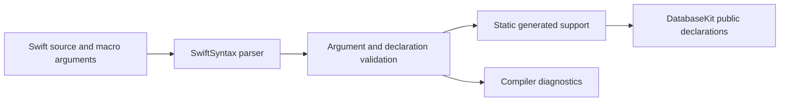
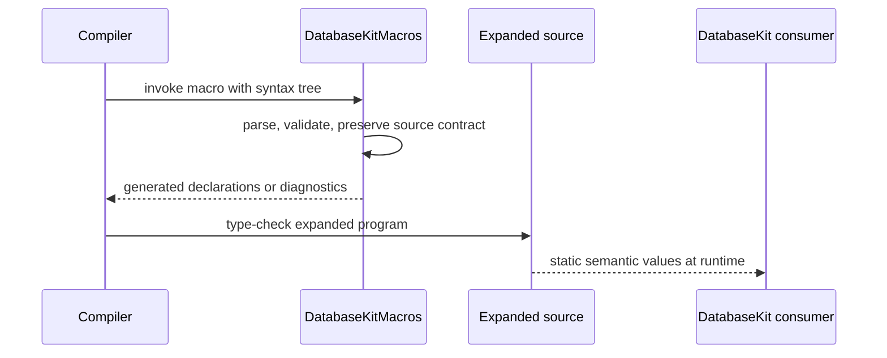

# DatabaseKitMacros

## Purpose and Scope

`DatabaseKitMacros` is the compiler-plugin implementation for the public macro
declarations in [`DatabaseKit`](../DatabaseKit/DESIGN.md). It turns source-level
model, field, index, relationship, ontology, and Directory declarations into
static generated support and compile-time diagnostics.

- Parent: [`database-kit` package design](../../DESIGN.md).
- Children: none; parser and expansion files are implementation units of this
  one compiler-plugin module.
- Dependencies: host-side `Foundation`, `SwiftSyntax`, `SwiftSyntaxBuilder`,
  `SwiftSyntaxMacros`, `SwiftDiagnostics`, `SwiftCompilerPlugin`, and
  `DatabaseTypes`.
- Dependent: the `DatabaseKit` target and its macro-expansion tests.

The target is a compiler plugin, not a reusable runtime library and not a
semantic owner separate from `DatabaseKit`.

## Responsibilities and Boundaries

This module owns:

- parsing and validating macro arguments;
- generating static `Persistable`, `Field`, schema, index, relationship,
  ontology, polymorphic, and Directory support;
- preserving source spelling where it affects name resolution or declaration
  semantics;
- emitting compiler diagnostics for invalid declarations before generated code
  can represent an invalid contract.

It does not own runtime model behavior, storage or Directory resolution,
transactions, authorization, wire encoding, transport, Foundation adapters,
application schemas, or a global macro/runtime registry.

## Related Designs

| Design | Relationship | Contract used | Summary | Cautions |
|---|---|---|---|---|
| [`../../DESIGN.md`](../../DESIGN.md) | package parent | module ownership and static/Embedded boundary | Defines this target as the implementation of the DatabaseKit macro surface. | This plugin is not a package product. |
| [`../DatabaseKit/DESIGN.md`](../DatabaseKit/DESIGN.md) | public contract owner | generated declaration shapes and semantic validation | Defines what generated code means. | The plugin must not invent a second semantic contract. |
| [`../../../SPEC.md`](../../../SPEC.md) | system authority | declaration-versus-execution boundary | Keeps Directory declaration separate from StorageKit mechanics. | Generated path values are data, not storage capabilities. |

## Architecture

The plugin depends on primitive values only where generated declarations need
their representations. Host-side compiler utilities may use Foundation, but
the generated `DatabaseKit` program has no Foundation dependency. The plugin
does not import or execute StorageKit or Framework.

## Contracts and Invariants

- Macro expansion is deterministic for a fixed source tree and toolchain.
- `#Directory` and `@PolymorphicDirectory` static path components accept only
  the ordinary single-line literal form required by the declaration contract;
  raw, multiline, interpolated, empty, or otherwise unsupported forms produce
  diagnostics rather than silently changing bytes.
- `layer:` is admitted only for the declared `DirectoryLayer` cases. The
  validated expression is preserved where generated source must retain its
  original name resolution; a foreign base is rejected.
- Generated fields retain typed model/value identity. The plugin does not
  emit runtime key-path or existential metadata as a substitute.
- Unsupported macro arguments never generate placeholder metadata or a
  successful fallback. Diagnostics are explicit and typed at the generated
  declaration boundary.
- The plugin creates no process-wide mutable state and registers no runtime
  model or operation descriptor.
- The public macro declarations remain in `DatabaseKit`; this target supplies
  only their compiler implementation and is not directly imported by users as
  a semantic runtime module.

## Runtime Flows

This module has a compile-time flow only:

## State, Ownership, and Lifecycle

- Syntax trees, parser state, and generated declaration buffers live only for
  one compiler invocation and are owned by that invocation.
- No macro expansion state escapes into a runtime value except the generated
  declaration data explicitly defined by `DatabaseKit`.
- The plugin target has no connection, transaction, cursor, authority, or
  persistent storage lifecycle.

## Failure, Concurrency, and Constraints

- Invalid syntax and declaration values become compiler diagnostics; they are
  not represented as empty metadata or runtime traps.
- Expansion code must remain compatible with the pinned Swift 6.4 and
  SwiftSyntax release range declared by the package manifest.
- The generated program does not use Foundation, reflection, Codable
  persistence, JavaScriptKit, or backend-specific APIs. Host-side Foundation
  use is confined to compiler-plugin implementation and never enters the
  standard or Embedded declaration graph.

## Verification and Change Impact

| Contract | Evidence owner |
|---|---|
| Parser acceptance and rejection behavior | `Tests/DatabaseKitTests/Model/DirectoryDeclarationMacroParsingTests.swift` and related validation suites |
| Generated model, field, index, relationship, and polymorphic declarations | `Tests/DatabaseKitTests/Model` macro expansion suites |
| Embedded compiler compatibility | `Tests/DatabaseKitDeclarationContract` release compilation with the pinned Embedded WASM SDK |

Changes to argument grammar, generated declarations, or diagnostic behavior
require this design, `DatabaseKit/DESIGN.md`, and the corresponding behavioral
tests to move together. Runtime interpretation changes are out of scope for
this module.
