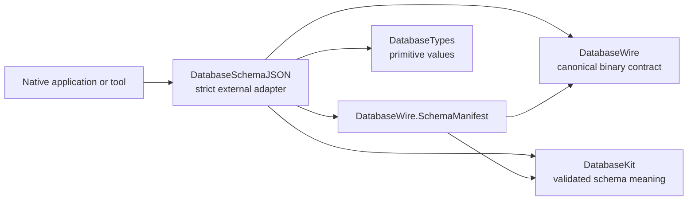
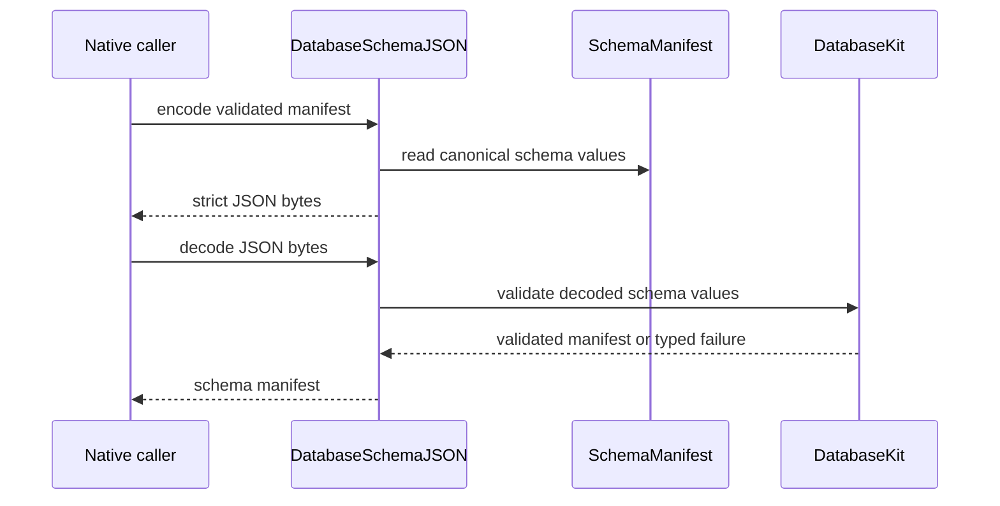

# DatabaseSchemaJSON

## Purpose and Scope

`DatabaseSchemaJSON` is the optional native strict-JSON adapter for the
validated `SchemaManifest` and related schema values. It gives applications and
tools an external JSON representation without making JSON the canonical schema
or wire representation.

- Parent: [`database-kit` package design](../../DESIGN.md).
- Children: none; codec, strict parser, and scalar helpers are implementation
  units of this module.
- Dependencies: `DatabaseKit`, `DatabaseWire`, and `DatabaseTypes`; the native
  implementation uses Foundation for its JSON boundary.
- Dependents: native applications, tools, and schema administration surfaces
  that explicitly choose this product.

It is excluded from the canonical Embedded dependency graph. Schema meaning is
owned by `DatabaseKit`; binary schema operations are owned by `DatabaseWire`.

## Responsibilities and Boundaries

This module owns:

- strict JSON encoding and decoding of `SchemaManifest`;
- JSON-safe adaptation of canonical field values and index definitions;
- duplicate-key, unknown-key, malformed-value, and numeric-shape diagnostics;
- the native external-format boundary and its typed `SchemaJSONError` values.

It does not own schema meaning, model macros, binary framing, operation
dispatch, transport, storage, transactions, query planning, or application
schema policy.

## Related Designs

| Design | Relationship | Contract used | Summary | Cautions |
|---|---|---|---|---|
| [`../../DESIGN.md`](../../DESIGN.md) | package parent | adapter and canonical-graph boundary | Places JSON outside the semantic and Embedded core. | JSON is not a second schema authority. |
| [`../DatabaseKit/DESIGN.md`](../DatabaseKit/DESIGN.md) | semantic dependency | validated schema and field values | Supplies the logical schema values being adapted. | This module must not accept invalid schema values as successful output. |
| [`../DatabaseWire/DESIGN.md`](../DatabaseWire/DESIGN.md) | binary dependency | `SchemaManifest` and wire field/value contracts | Keeps external JSON and canonical binary representations consistent. | Wire version and operation meaning remain in DatabaseWire. |

## Architecture

## Contracts and Invariants

- Encoding emits one deterministic JSON representation for a validated schema
  manifest; decoding accepts only the documented keys and value shapes.
- Duplicate or unknown keys, malformed base64url, invalid numeric forms,
  unsupported field values, and trailing JSON input produce typed failures.
- JSON adaptation preserves every canonical `FieldValue` case without
  platform-dependent numeric inference or lossy conversion.
- A decoded schema manifest still passes the same `DatabaseKit` validation
  boundary before a runtime consumer can use it.
- The canonical schema fingerprint is derived from canonical DatabaseWire bytes;
  JSON formatting cannot change schema identity.
- This module does not define a new schema, operation, or binary wire version.
- Foundation and JSON types stop at this native external boundary and never
  enter `DatabaseKit`, `DatabaseWire`, or Embedded source graphs.

## Runtime Flows

## State, Ownership, and Lifecycle

- Codec state and parsed JSON values live for one encode/decode operation and
  are owned by the caller or returned value.
- The module has no global schema registry, storage connection, transaction,
  operation lease, transport, or durable state.
- Canonical byte ownership follows `DatabaseTypes`; JSON materialization occurs
  only at this external-format boundary.

## Failure, Concurrency, and Constraints

- The adapter is native-only because its JSON/Foundation boundary is not part
  of the canonical Embedded graph.
- JSON input is bounded and validated before constructing large arrays, byte
  values, or nested schema structures.
- Errors remain typed and visible; malformed input is never mapped to an empty
  schema or a default value.
- No shared mutable state or unchecked concurrency escape is part of the
  module contract.

## Verification and Change Impact

| Contract | Evidence owner |
|---|---|
| Strict encode/decode round trips | `Tests/DatabaseSchemaJSONTests` |
| Duplicate/unknown/trailing/malformed rejection | `Tests/DatabaseSchemaJSONTests` strict JSON suites |
| Canonical field-value preservation | `Tests/DatabaseSchemaJSONTests` field-value codec suites |
| Native-only graph boundary | Package dependency review and canonical/Embedded release builds |

Changes to schema JSON keys, numeric or byte representations, or failure
categories require this module design, the `SchemaManifest`/DatabaseWire
contract, and the strict behavioral tests to be reviewed together.
