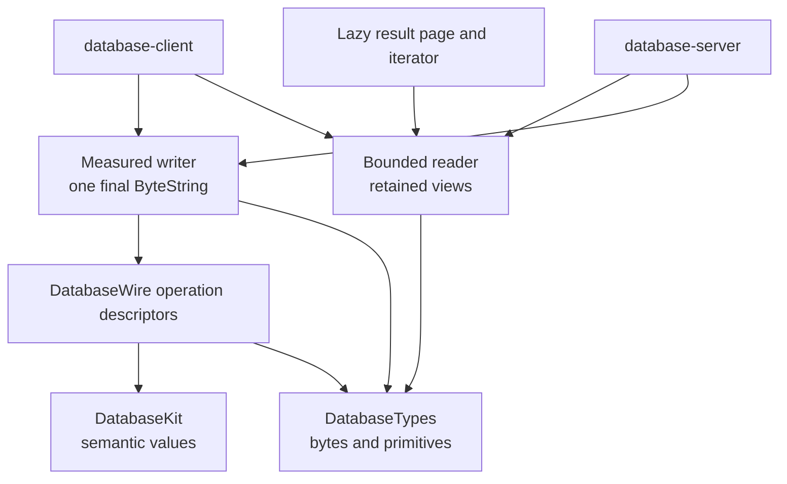
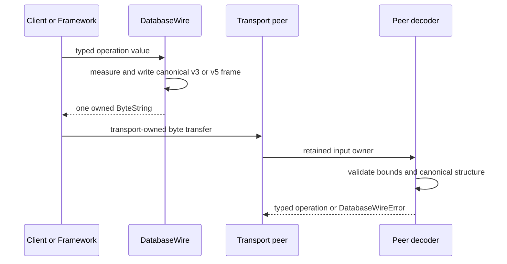

# DatabaseWire

## Purpose and Scope

`DatabaseWire` is the canonical bounded binary protocol module of
[`database-kit`](../../DESIGN.md). It encodes and decodes typed operations,
envelopes, semantic values, result pages, limits, and typed protocol failures
without owning transport or operation execution.

- Parent: [`database-kit` package design](../../DESIGN.md).
- Children: none; `RDF` source files and operation families are classifications
  inside this module, not independent authorities.
- Dependencies: `DatabaseKit` and `DatabaseTypes`.
- Dependents: `database-client`, `database-server`,
  `database-framework` integration paths, and the native schema JSON adapter.

The wire contract is selected at compile time. The default graph is version 3
and target-free. The non-default `MultiBase` graph is version 5 and
target-bound.

## Responsibilities and Boundaries

`DatabaseWire` owns:

- canonical request/response envelope framing;
- closed typed operation descriptors and the operation catalog;
- bounded binary readers and writers;
- wire representations for model, schema, query, graph, ontology, SHACL,
  command, mutation, maintenance, and job values;
- lazy result pages, iterators, provenance payloads, and retained byte views;
- protocol limits and typed malformed, unsupported, and resource-limit errors.

It does not own the semantic meaning declared by `DatabaseKit`, client or
server transport, operation dispatch, authorization evaluation, query
planning/execution, storage, transaction lifetime, or application commands.

## Related Designs

| Design | Relationship | Contract used | Summary | Cautions |
|---|---|---|---|---|
| [`../../DESIGN.md`](../../DESIGN.md) | package parent | v3/v5 trait matrix and wire ownership | Fixes the standard and optional protocol graphs. | No runtime version negotiation or target fabrication. |
| [`../DatabaseKit/DESIGN.md`](../DatabaseKit/DESIGN.md) | semantic dependency | validated models, schema, query, graph, and MultiBase values | Supplies meanings encoded by this module. | Wire codecs must not add semantic execution policy. |
| [`../../../database-client`](https://github.com/1amageek/database-client) | downstream consumer | typed encoding/decoding and request correlation | Adapts operations to transports. | Transport and cancellation ownership remain in the client. |
| [`../../../database-server/DESIGN.md`](../../../database-server/DESIGN.md) | downstream consumer | envelope and operation catalog | Dispatches decoded operations and publishes results. | Server does not move dispatch or durable jobs into this module. |

## Architecture

The two protocol graphs are explicit:

| Build | Header and request shape | Operation target |
|---|---|---|
| Default | DatabaseWire v3; request contains request ID, operation, metadata, and payload | No target field; one ordinary database root |
| `MultiBase` | DatabaseWire v5; request contains the same data plus an explicit target | Database, Base, or Composition target as declared by the trait |

## Contracts and Invariants

- The default `EnvelopeWireFormat.protocolVersion` is 3. The default request
  envelope has no target and the default operation catalog has no Base,
  Composition, or Grant families.
- With `MultiBase`, the protocol version is 5, target-bearing operation
  requests are explicit, and Base/Composition/Grant operation families are
  compiled into the catalog. The trait does not provide a compatibility alias
  or runtime downgrade path.
- Operation descriptors and their encode/decode witnesses are constructed by
  `DatabaseWire`; users cannot provide an arbitrary raw wire conformance or
  operation identifier.
- Encoding first measures exact frame size and writes one final owned
  `ByteString`. Results and readers retain that owner and expose bounded
  ranges/iterators rather than eagerly copying every element.
- Decoders apply frame, string, byte, collection, nesting, and operation limits
  before allocation. They reject truncation, malformed or unknown values,
  non-canonical order, invalid RDF structure, and trailing bytes.
- Typed `DatabaseWireError` and related errors preserve the distinction between
  malformed input, unsupported operation, resource limit, authorization,
  conflict, retryability, and server failure. No failure is normalized into an
  empty success response.
- `DatabaseWire` serializes semantic contracts; it does not decide query plans,
  storage keys, transactions, leases, or publication ownership.

## Runtime Flows

Bulk pages retain their frame owner while consumers iterate or request bounded
materialization. Transport, dispatch, transaction, and publication steps are
outside this module.

## State, Ownership, and Lifecycle

- A writer owns its temporary measurement state and produces one final
  `ByteString` at the encoding boundary.
- A reader, result page, view, and iterator retain the same input owner for
  their lifetime. Pointer borrows used to inspect that owner are synchronous
  and cannot escape their borrow scope.
- The module has no network connection, retry loop, operation registry with
  mutable global state, transaction, cursor, authority, or durable job state.
- Any copy required by an independent transport or native external-format
  boundary is owned by that consumer; internal wire stages retain one owner.

## Failure, Concurrency, and Constraints

- Canonical wire values and readers are `Sendable` where their owner/view
  contract permits; no unchecked mutable global state is used.
- Unknown, oversize, malformed, and trailing input fails before it can become a
  runtime operation.
- A decoder never trusts a length or count before checked arithmetic and the
  corresponding configured limit.
- The canonical module has no Foundation, Codable, URLSession, JavaScriptKit,
  or backend dependency and must compile for standard and Embedded WASM.
- Native JSON adaptation and Foundation scalar conversion are separate module
  contracts and cannot be imported into this canonical graph.

## Verification and Change Impact

| Contract | Evidence owner |
|---|---|
| Operation catalog and v3/v5 envelope mapping | `Tests/DatabaseWireTests` operation and envelope suites |
| Truncation, bounds, malformed, non-canonical, and trailing-input rejection | `Tests/DatabaseWireTests` decoder suites |
| Retained owner, lazy page, iterator, and exact-frame behavior | `Tests/DatabaseWireTests` result and byte-ownership suites |
| Standard and `MultiBase` protocol graphs | Isolated native package harness runs (641 and 656 total package tests) |
| Standard and Embedded compatibility | Package README release builds for `DatabaseWire` |

Any change to a wire byte, operation family, version, target field, limit,
failure category, or ownership boundary requires this module design, the
package design, golden/behavioral tests, and all downstream mapping consumers
to be reviewed together.
